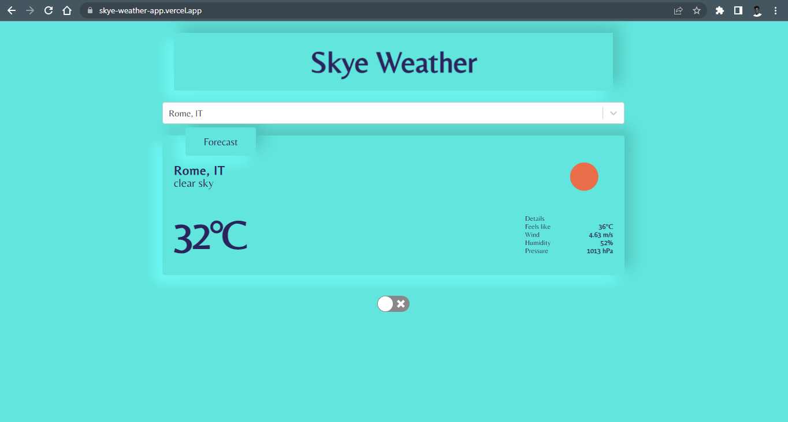
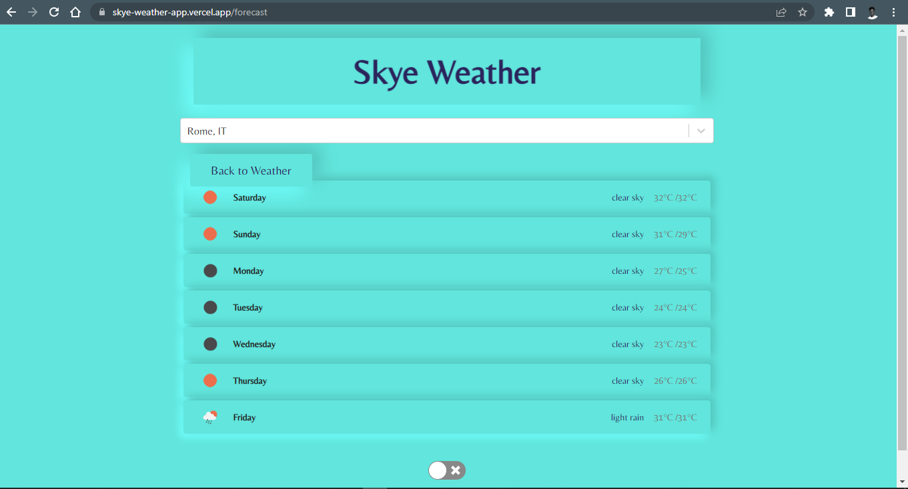

# Phase 1 Project: Skye Weather

    Author: Wycliffe Ndiba

    Languages: HTML, CSS & Javascript

## Description

A web application that displays the current weather for a user-defined location.

The application will use OpenWeatherMap API to retrieve the current weather for a user-defined location.

## Setup

### Live Link

[Skye Weather](https://skye-weather-app.vercel.app/)

### Setup

Install dependencies:

    npm install

Start the server:

    npm start

## Deliverables

Some of the deliverables of this project are:

- Display the current weather of a city.

- The user can input a city name and the application will display the current weather for that city.

- The application will deisplay some details about the weather such as:

    - Temperature
    - Humidity
    - Wind Speed
    - max and min temperatures

### Bonus Deliverables

While doing this project in vanilla JS, I was to add some additional features to the application but didn't have the knowledge to do so.

Now with React, these are some of the deliverables that I would love to add to the application:

- The application should showcase a five day forecast for the next five days.

- The application should display an error message if the user enters an invalid city name.

- The user should be able to favourite a city and save it to their favourites list.

    - The user should be able to view their saved favourites list.

## Progress

- The application can search for a city in the search bar.
- The application can fetch data from the openweathermap API. (Free version)
- The application displays:
    - the city's name
    - temperature in °C
    - an icon describing the condition of the weather
    - the description of the weather (cloudy, sunny)
    - the day's humidity
    - the wind speed.
- Currently working on getting the date and time to function.

## Screenshots

## Known Bugs

## Licence

The MIT License (MIT)

- [License](./LICENSE)